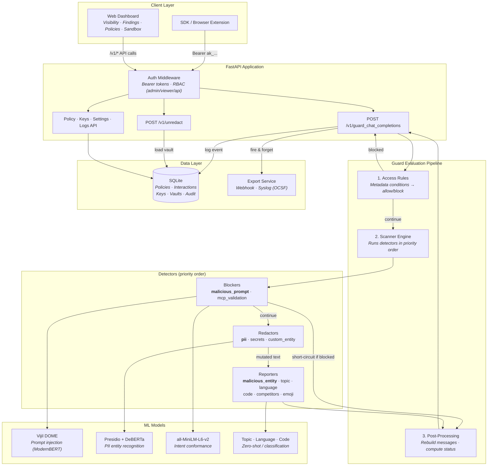

# Tidewall Server

     

Open-source AI security guard server. Tidewall sits between your applications
and AI providers, scanning every prompt and response for prompt injection,
PII, secrets, and policy violations — and applying block / redact / report
decisions in real time.

Tidewall is a pluggable AI security guard. It bundles open-source detection
models for prompt injection, PII, secrets, malicious entities, topics, and
language — wired into an AIDR-style `guard_chat_completions` API contract so
the broader collector ecosystem (browser extensions, language SDKs, gateway
plugins) can point at Tidewall as a drop-in alternative. Features include
multi-policy management, per-entity-type redaction (6 methods including
AES-FF1-256 format-preserving encryption), API key authentication with RBAC,
OCSF event export with MITRE ATLAS mapping, threat intelligence, MCP tool
validation, intent conformance detection, and a built-in web dashboard.

Powered by HuggingFace Transformers, Microsoft Presidio, and detect-secrets.

---

## Architecture



**Request flow:** Client sends messages → Auth middleware validates token → Access rules pre-filter → Scanner engine runs detectors (blockers first, then redactors, then reporters) → Post-processing computes final status → Response returned, event logged asynchronously.

---

## Quick Start

Tidewall always requires authentication. On a database with no API keys you
supply the first one via `BOOTSTRAP_KEY`; only its hash is stored, and it is
never logged or printed. There is no unauthenticated mode.

### Docker (recommended)

```bash
git clone https://github.com/tidewall-security/tidewall-server.git
cd tidewall-server

export BOOTSTRAP_KEY="ak_$(python3 -c 'import secrets; print(secrets.token_hex(16))')"
echo "Save this — it is your first admin key: $BOOTSTRAP_KEY"

docker compose up --build
```

### Local Development (Python 3.12)

```bash
python3.12 -m venv .venv && source .venv/bin/activate
pip install -e .

export BOOTSTRAP_KEY="ak_$(python3 -c 'import secrets; print(secrets.token_hex(16))')"
echo "Save this — it is your first admin key: $BOOTSTRAP_KEY"

python -m app
```

`python -m app` reads `HOST` and `PORT` from the environment. Later starts
against the same database do not need `BOOTSTRAP_KEY` — a key already exists.

### First request

```bash
curl -H "Authorization: Bearer $BOOTSTRAP_KEY" \
     -H "Content-Type: application/json" \
     -d '{"guard_input":{"messages":[{"role":"user","content":"hello"}]},"event_type":"input"}' \
     http://localhost:8080/v1/guard_chat_completions
```

| Endpoint | URL |
|----------|-----|
| Web Dashboard | http://localhost:8080/ui/visibility |
| Health Check | http://localhost:8080/health |
| Guard API | http://localhost:8080/v1/guard_chat_completions |

Open the dashboard and paste the same key into the prompt it shows. The page
itself is public — it holds no data — and every call it makes is authenticated.

The interactive API docs (`/docs`, `/redoc`) are not served: Swagger UI fetches
the schema from the browser without an `Authorization` header, so a protected
schema leaves the page permanently broken. No HTTP schema endpoint is served at
all — the routes are simply not registered.

---

## Features

### Detection & Response
- **11 detectors** — prompt injection, PII, secrets, topics/toxicity, language, code, competitors, malicious entities (IP/URL/domain), custom regex, emoji, MCP tool validation
- **Composite malicious prompt detector** — 4 sub-detectors: generic ML injection, custom malicious list, custom benign list, intent conformance
- **6 redaction methods** — replacement, mask, partial mask, hash, format-preserving encryption (AES-FF1-256), defang
- **Per-entity-type rules** — different redaction actions per entity type (e.g., mask SSNs, hash emails, defang URLs)
- **Threat intelligence** — local IP/domain/URL blocklists with wildcard and CIDR support, ML URL classification
- **Intent conformance** — embedding similarity checks against global model intent and per-request app intent (system prompt)
- **MCP validation** — tool name similarity checking for agentic/MCP tool_listing events

### Policy & Access Control
- **Multi-policy engine** — named policies with per-event-type rule sets (input/output/tool_input/tool_output/tool_listing)
- **Access rules** — metadata-based conditions (user_id, app_id, model) with 6 operators, sequential evaluation before detectors
- **5-value status** — allowed, reported, blocked, alerted (report-only block), transformed
- **Per-rule-set report-only mode** — detections logged but not enforced, matching an industry behavior
- **Custom prompt lists** — global benign/malicious override lists (substring, regex, exact match)

### Infrastructure
- **API key auth with RBAC** — 3 roles (admin/viewer/api), per-collector keys bound to policies, always enforced
- **OCSF event export** — Data Security Finding (class 2006) with MITRE ATLAS mapping, AIDR-style export format option
- **Webhook + syslog dispatch** — fire-and-forget export to configured targets, status-based event filtering
- **Activity audit log** — records all config changes with old/new JSON snapshots
- **SQLAlchemy + Alembic** — 10-table schema with automatic migrations on startup
- **Web dashboard** — Visibility (Sankey), Findings (table), Policies (editor), Sandbox (prompt tester)

---

## Configuration

| Variable | Default | Description |
|----------|---------|-------------|
| `DB_URL` | `sqlite:///data/tidewall.db` | SQLAlchemy database URL |
| `POLICY_FILE` | `policy.yaml` | YAML policy file for first-boot seeding |
| `LOG_LEVEL` | `info` | Logging verbosity |
| `VAULT_ENCRYPTION_KEYS` | unset | `id:base64` entries, comma separated. Enables reversible redaction |
| `VAULT_ENCRYPTION_CURRENT` | unset | Which key id new vaults are sealed under |

### Enabling reversible redaction

Both variables must be set; either alone is a startup error rather than a
silent downgrade. Material is 32 raw bytes, base64 encoded:

```bash
python -c "import os,base64; print('k1:' + base64.b64encode(os.urandom(32)).decode())"

export VAULT_ENCRYPTION_KEYS='k1:8Xb2...=='
export VAULT_ENCRYPTION_CURRENT='k1'
```

Key ids are operator-chosen labels and **must stay stable** — every stored row
names the id it was sealed under. To rotate, add the new key alongside the old,
repoint `VAULT_ENCRYPTION_CURRENT` at it, and keep the previous key listed for
at least the vault TTL. Nothing is re-encrypted; old rows simply expire.

---

## Authentication

API keys are passed as `Authorization: Bearer ak_...` headers. Each key is a collector token bound to a specific policy.

### Roles

| Role | Guard API | Unredact | Logs/Dashboard | Policies/Rules | Keys/Settings |
|------|-----------|----------|----------------|---------------|---------------|
| `api` | Yes | Yes | No | No | No |
| `viewer` | Yes | Yes | Yes | No | No |
| `admin` | Yes | Yes | Yes | Yes | Yes |

Role is necessary for reversal and not sufficient. A vault can only be reversed
by the policy that created it, and never by a device credential whatever role it
holds — see [Who may reverse](#who-may-reverse).

### First Boot

Authentication is on by default. With no API keys in the database, the server
requires `BOOTSTRAP_KEY`:

```bash
export BOOTSTRAP_KEY="$(python -c 'import secrets; print("ak_" + secrets.token_hex(16))')"
docker compose up
```

Tidewall does not generate this for you. A generated key would have to be
emitted to logs or stdout to reach you, and both are routinely collected and
retained — which is how a permanent administrator credential ends up in a log
aggregator. Only the hash is stored.

Starting without it fails with an explanatory error rather than creating a
credential you cannot see.

---

## API Reference

| Method | Path | Role | Description |
|--------|------|------|-------------|
| `POST` | `/v1/guard_chat_completions` | api+ | Guard AI interactions |
| `POST` | `/v1/unredact` | api+ | Reverse redactions via the vault |
| `GET` | `/v1/policies` | viewer+ | List policies |
| `POST` | `/v1/policies` | admin | Create policy |
| `GET` | `/v1/policies/{id}` | viewer+ | Get policy |
| `PATCH` | `/v1/policies/{id}` | admin | Update policy |
| `DELETE` | `/v1/policies/{id}` | admin | Delete policy |
| `POST` | `/v1/policies/import` | admin | Import from YAML |
| `GET` | `/v1/policies/{id}/export` | viewer+ | Export as YAML |
| `GET` | `/v1/policies/{id}/rule-sets/{et}` | viewer+ | Get rule set |
| `PATCH` | `/v1/policies/{id}/rule-sets/{et}` | admin | Update rule set |
| `GET` | `/v1/policies/{id}/rule-sets/{et}/access-rules` | viewer+ | List access rules |
| `POST` | `/v1/policies/{id}/rule-sets/{et}/access-rules` | admin | Create access rule |
| `PATCH` | `/v1/policies/{id}/rule-sets/{et}/access-rules/{rid}` | admin | Update access rule |
| `DELETE` | `/v1/policies/{id}/rule-sets/{et}/access-rules/{rid}` | admin | Delete access rule |
| `GET` | `/v1/keys` | admin | List API keys |
| `POST` | `/v1/keys` | admin | Create key (returns full key once) |
| `DELETE` | `/v1/keys/{id}` | admin | Delete key |
| `GET` | `/v1/logs` | viewer+ | Query interactions |
| `GET` | `/v1/logs/stats` | viewer+ | Aggregate stats |
| `GET` | `/v1/logs/flows` | viewer+ | Sankey diagram data |
| `GET` | `/v1/activity` | admin | Audit log |
| `GET` | `/v1/settings/prompt-lists` | admin | List custom prompt lists |
| `POST` | `/v1/settings/prompt-lists` | admin | Create prompt list entry |
| `PUT` | `/v1/settings/prompt-lists/{id}` | admin | Update entry |
| `DELETE` | `/v1/settings/prompt-lists/{id}` | admin | Delete entry |
| `GET` | `/v1/settings/export-targets` | admin | List export targets |
| `POST` | `/v1/settings/export-targets` | admin | Create export target |
| `PATCH` | `/v1/settings/export-targets/{id}` | admin | Update target |
| `DELETE` | `/v1/settings/export-targets/{id}` | admin | Delete target |
| `GET` | `/v1/settings/threat-intel` | admin | Threat intel config |
| `PUT` | `/v1/settings/threat-intel` | admin | Update threat intel |
| `GET` | `/v1/settings/model-intent` | admin | List model intent statements |
| `POST` | `/v1/settings/model-intent` | admin | Create intent statement |
| `PUT` | `/v1/settings/model-intent/{id}` | admin | Update intent |
| `DELETE` | `/v1/settings/model-intent/{id}` | admin | Delete intent |
| `GET` | `/health` | public | Health check |
| `GET` | `/ui/{page}` | public | Dashboard shell (data-free; its API calls are authenticated) |

---

## Redaction and Reversal

### What the model actually receives

**Every detected entity is replaced with a typed, numbered placeholder** —
`[REDACTED_EMAIL_ADDRESS_1]`, `[REDACTED_US_SSN_2]` — and that is what is sent
onward, whatever redaction method the policy names.

The numbering matters: two mentions of the same value in one prompt get the same
placeholder, and two different values get different ones. The model can still
reason about "the first email" versus "the second" without seeing either.

### Redaction methods change the REPORT, not the prompt

This is the part that surprises people, so it is worth stating plainly. The
per-entity-type method controls how the value appears in findings, exports and
the dashboard. It does **not** change the text the model receives.

| Method | Action label | Reported as | Sent to the model |
|---|---|---|---|
| Replacement | `redacted:replaced` | `<US_SSN>` | `[REDACTED_US_SSN_1]` |
| Mask | `redacted:masked` | `***********` | `[REDACTED_US_SSN_1]` |
| Partial Mask | `redacted:masked` | `***-**-7890` | `[REDACTED_US_SSN_1]` |
| Hash | `redacted:hashed` | `a1b2c3d4e5f6` | `[REDACTED_US_SSN_1]` |
| Defang | `defanged` | `http://evil[.]com` | `[REDACTED_URL_1]` |

Choose a method for what an operator should see in a finding — a masked tail is
useful for recognising a card, a hash is useful for correlating without
disclosing. None of them weakens or strengthens what the model is shown.

```yaml
confidential_and_pii_entity:
  enabled: true
  action: redact
  rules:
    - type: US_SSN
      action: replacement
    - type: PHONE_NUMBER
      action: partial_mask
      mask_char: "*"
      unmasked_right: 4
    - type: EMAIL_ADDRESS
      action: hash
      salt: "my-salt"
```

### Reversal

Because the placeholder is a token rather than a mask, redaction is
**reversible** — the mapping from placeholder to original is kept server-side and
`POST /v1/unredact` exchanges one for the other.

This is tokenisation, not encryption. The placeholder has no mathematical
relationship to the value it stands for, so it discloses nothing on its own; the
mapping is the only way back. That is the deliberate alternative to
format-preserving encryption, whose output is reversible ciphertext and stays in
scope for most compliance regimes.

The mapping is:

- **encrypted at rest** with AES-256-GCM under a keyring, with the row's own
  identity bound as associated data so a stored blob cannot be moved to another
  row or given a longer life
- **short-lived** — one hour — and **deleted**, not merely refused, when it expires
- **off by default.** Set `VAULT_ENCRYPTION_KEYS` and `VAULT_ENCRYPTION_CURRENT`
  to enable it. Without them, redaction still runs and is simply irreversible:
  the server will not store the mapping anywhere it cannot protect it.

If vault retention cannot be scheduled, reversible redaction **disables itself**
and says so. A deployment that cannot promise to delete the plaintext mapping
should not be collecting it.

### Who may reverse

A vault belongs to **the policy of the key that created it**, and only that
policy's credentials can reverse it. A vault id is not a password: it travels in
a response body, which reaches proxies, APM tools, browser devtools and the
caller's own logs. Possession of one is not authority to use it.

An id that belongs to another policy is answered exactly as a missing one is —
same status, same body. A caller able to tell "not yours" from "no such vault"
could enumerate other policies' ids.

**An API key must be bound to a policy.** Creating an `api`-role key without one
is refused, because an unbound collector owns no vault and its redactions could
never be reversed — it would guard perfectly well and then be refused at
`/v1/unredact`, which reads as a bug rather than a configuration choice. Two
paths still reach that state and both are reported rather than silent: the
bootstrap admin key is installed before any policy exists, and deleting a policy
sets its keys' binding to null.

**Deleting a policy destroys its vaults.** Retention never becomes a reason a
policy cannot be deleted, and a vault whose owner is gone must not outlive it.

Reversal is **refused to device credentials outright**, whatever policy they
carry. An enrolled browser extension holds the `api` role so it can call the
guard; handing recovered PII back into a page is not something a policy binding
should be able to authorise.

### Upgrading

The migration that adds ownership **deletes every existing vault**. No owner was
ever recorded for them and none can be recovered; they are at most an hour old
and hold the mapping itself.

**Restart every worker as part of that upgrade.** The vault cache is per
process, and a cache hit answers without consulting the row, so deleting rows
does not revoke what a running process already holds.

## Event Export (OCSF)

Export guard events to external systems in OCSF Data Security Finding (class 2006) format with MITRE ATLAS mapping.

```yaml
# Configure via /v1/settings/export-targets
{
  "name": "siem-ingest",
  "type": "webhook",           # webhook | syslog
  "format": "ocsf",            # ocsf | aidr_compat | raw
  "config": {"url": "https://siem.company.com/ingest", "headers": {"Authorization": "Bearer token"}},
  "events": ["blocked", "alerted", "transformed"]
}
```

**MITRE ATLAS mapping:**

| Detection | ATLAS Technique | Tactic |
|-----------|----------------|--------|
| `malicious_prompt` | AML.T0051 (LLM Prompt Injection) | Execution |
| `confidential_and_pii_entity` | AML.T0057 (LLM Data Leakage) | Exfiltration |
| `secret_and_key_entity` | AML.T0057 (LLM Data Leakage) | Credential Access |
| `topic` | AML.T0048.001 (Reputational Harm) | Impact |
| `competitors` | AML.T0048.000 (Financial Harm) | Impact |

---

## Detector Reference

Every model is pinned to an immutable commit in `app/model_registry.py`, which
is the single source of truth; the identifiers below are for reference. Model
licences are listed in `NOTICE`.

| Detector | Engine | ML Model | Actions |
|---|---|---|---|
| `malicious_prompt` | HF text-classification + custom lists + intent conformance | `protectai/deberta-v3-base-prompt-injection-v2` + `sentence-transformers/all-MiniLM-L6-v2` | Block, Report |
| `confidential_and_pii_entity` | Presidio Analyzer + Anonymizer | `en_core_web_lg` (spaCy) + Presidio recognizers | 6 redaction methods |
| `secret_and_key_entity` | detect-secrets | 18 vendor pattern detectors (AWS, GitHub, JWT, Stripe, …) | 6 redaction methods |
| `malicious_entity` | Entity extraction + threat intel + HF text-classification | `kmack/malicious-url-detection` | Defang, Block, Report |
| `mcp_validation` | SequenceMatcher (stdlib) | N/A (structural check) | Block, Report |
| `topic` | HF zero-shot + text-classification | `MoritzLaurer/roberta-base-zeroshot-v2.0-c` + `unitary/unbiased-toxic-roberta` | Block, Report |
| `language` | HF text-classification | `papluca/xlm-roberta-base-language-detection` | Block, Report |
| `code` | HF text-classification | `philomath-1209/programming-language-identification` | Block, Report |
| `competitors` | Presidio NER + custom recognizer | NER-based deny-list matcher | Block, Report |
| `custom_entity` | `re.finditer` (stdlib) | User-defined patterns | Replacement only |
| `emoji` | Custom regex (stdlib) | N/A (Unicode range) | Report |

---

## Comparison with AIDR-style Platforms

| Feature | AIDR-style Platform | Tidewall |
|---|---|---|
| API contract | `guard_chat_completions` | Same |
| Detectors | 10 (proprietary models) | 11 (open-source models + MCP validation) |
| Redaction methods | 5 (replace, mask, partial, hash, defang) | 6 (same, plus format-preserving encryption) |
| Policy model | Per-event-type rule sets | Same |
| Access rules | Metadata conditions, sequential evaluation | Same (6 operators) |
| Status values | 5 (allowed/reported/blocked/alerted/transformed) | Same |
| Custom prompt lists | Global benign/malicious override lists | Same |
| Intent conformance | Embedding similarity + system prompt | Same (all-MiniLM-L6-v2) |
| MCP validation | Tool name similarity | Same (SequenceMatcher) |
| Threat intel | Proprietary platform | Local blocklists + ML URL classification |
| Event export | LogScale/NextGen SIEM | OCSF + AIDR-style export format, webhook/syslog |
| Auth | Falcon SSO + collector tokens | API keys with RBAC |
| Deployment | Multi-region cloud | Single-node Docker |
| Cost | Vendor subscription | Free, Apache 2.0 |

---

## License

Apache License 2.0 — see [LICENSE](LICENSE) and [NOTICE](NOTICE).

## Contributing

See [CONTRIBUTING.md](CONTRIBUTING.md) for the contribution workflow and
development setup. Vulnerability reports go to [SECURITY.md](SECURITY.md).
